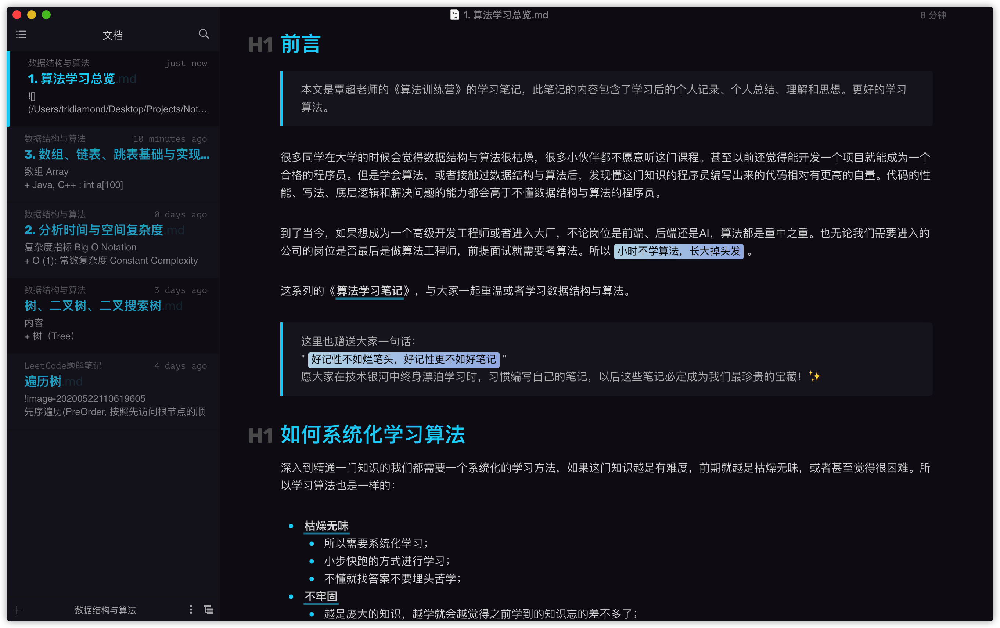
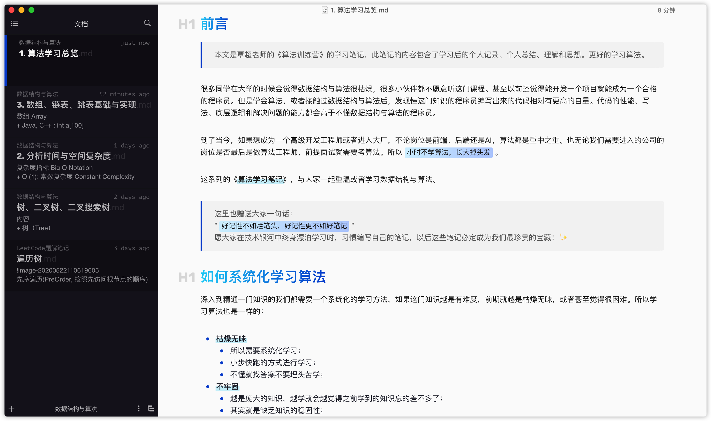

# Obsidian
> A theme for the wonderful [Typora](https://typora.io), inspired by [Hexo-theme-obsidian](https://tridiamond.me)'s colors and elegancy.

Code fence themes are adapted from CodeMirror's *3024 Day* and *Dracula* themes for Obsidian night and day, respectively.

> Note: These themes have been designed and tested for both **MacOS & Windows** (though primarily Mac).

## Installation

Decompress the latest release from [here](https://github.com/TriDiamond/typora-theme-obsidian/releases). In Typora's preferences windows, go to `General -> Themes` and click on `Open Theme Folder`. Drop all the decompressed files and folders in there, and enjoy!~

## Preview

Obsidian Night

Obsidian Day

### Related

- This theme is best for writing blogs with [Hexo-theme-obsidian](https://github.com/TriDiamond/hexo-theme-obsidian)